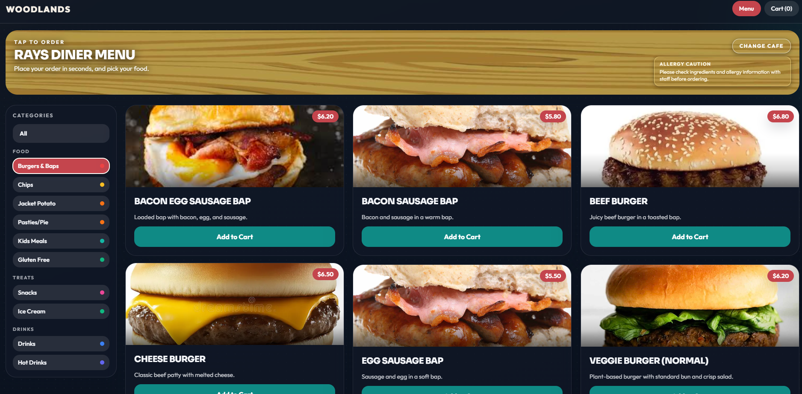
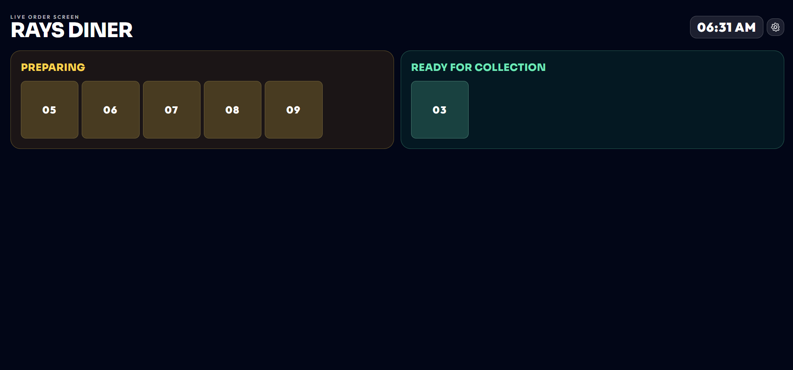

# Food Ordering Application

This README explains only how to use the live website.

## Main Portal

- `https://foodorder.pages.dev/`
Choose your cafe and start ordering.

## Screenshots

### Customer Portal Menu Card (`asset/1.png`)

This screen is the customer ordering menu with category navigation, item cards, and add-to-cart flow.

### Order Board Screen (`asset/2.png`)

This screen is the live order board used on the customer-facing monitor to show preparing and ready numbers.

### Staff New Orders Feed (`asset/3.png`)

`asset/3.png` is not in the repository yet. Add it and I will include it in this section immediately.

## Staff Login

- `https://foodorder.pages.dev/staff-login`
Staff sign in page for kitchen/admin access.

Default staff users:
- Admin: `admin@raysdiner.local` / `admin123`
- Kitchen: `kitchen@raysdiner.local` / `kitchen123`

## Rays Diner Links

- `https://foodorder.pages.dev/raysdiner/menu`
Customer menu for Rays Diner (browse categories and add food).
- `https://foodorder.pages.dev/raysdiner/cart`
Customer cart and checkout for Rays Diner.
- `https://foodorder.pages.dev/raysdiner/order-board`
Live order board screen for Rays Diner (preparing and ready numbers).

## Loves Grove Links

- `https://foodorder.pages.dev/lovesgrove/menu`
Customer menu for Loves Grove.
- `https://foodorder.pages.dev/lovesgrove/cart`
Customer cart and checkout for Loves Grove.
- `https://foodorder.pages.dev/lovesgrove/order-board`
Live order board screen for Loves Grove.

## Cosmic Cafe Links

- `https://foodorder.pages.dev/cosmiccafe/menu`
Customer menu for Cosmic Cafe.
- `https://foodorder.pages.dev/cosmiccafe/cart`
Customer cart and checkout for Cosmic Cafe.
- `https://foodorder.pages.dev/cosmiccafe/order-board`
Live order board screen for Cosmic Cafe.

## Staff Pages After Login

- `https://foodorder.pages.dev/new-orders`
Realtime incoming customer orders for kitchen/staff.
- `https://foodorder.pages.dev/staff-dashboard`
Staff dashboard (admin controls).
- `https://foodorder.pages.dev/staff-menu-management`
Add/edit/delete categories, menu items, extras, and images.
- `https://foodorder.pages.dev/end-of-day`
Generate end-of-day receipt and sales summary.

## Customer Usage Flow

1. Open `https://foodorder.pages.dev/`.
2. Choose cafe: Rays Diner, Loves Grove, or Cosmic Cafe.
3. Add items from menu and open cart.
4. Enter name and place order (email is optional for receipt).
5. Note the large order number shown on screen.
6. Watch the matching cafe order-board page until the order is ready.

## Staff Usage Flow

1. Open `https://foodorder.pages.dev/staff-login` and sign in.
2. Open `https://foodorder.pages.dev/new-orders`.
3. Select cafe in staff view and process orders.
4. Move orders through statuses and mark completed.
5. Use `https://foodorder.pages.dev/end-of-day` for daily totals.
